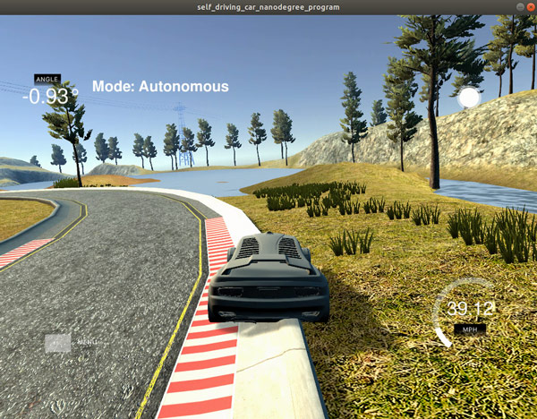
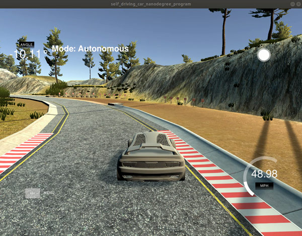
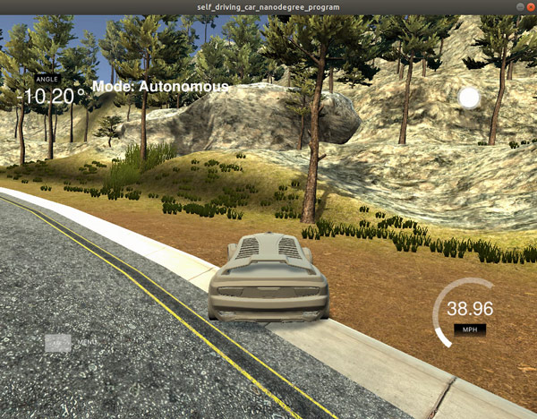
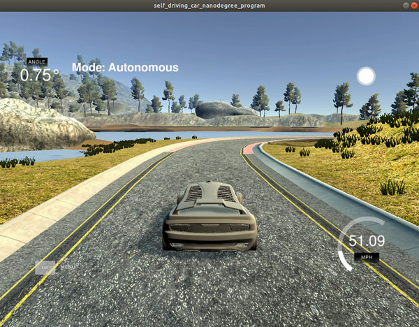

# CarND-Controls-PID

Self-Driving Car Engineer Nanodegree Program 
Implementation of PID control for steering and throttle control using Twiddle for hyperparameter tuning. 


##Implementation
In this project, the PID controller was implemented in C++. A steering and throttle data are exchanged between PID controlled and Car Simulator via a WebSocket interface.
Once PID controller receives Cross Track Error (CTE) from the simulator, UpdateError function ( lines ) calculates P, I and D errors. These Errors are used in TotalError (lines) method to calculate total error and adjusted steering value sent back to simulator.


##P, I, D components effects
###P - Proportional
The proportional component. P component has a maximum effect on the car's behavior as it is proportional to  Cross Track Error - the car's distance from the lane center
P = Kp * CTE 
If Kp value is too large the car starts to oscillate around the center line. But if Kp is too low the car cannot drive through curves.

The following video show car behavior with when one P is set to 0:

[](https://youtu.be/NvCxyh5avgo)

###I - Integral
The integral component reduces drifts from the center line.
I = Ki * sum(CTE), where Ki is a hyperparameter

The next video shows how setting I term affects car control:

[](https://youtu.be/qkpq2aH3Hbk)

###D - Differential
The differential (D) component of the PID controller is the difference between the current CTE and the previous CTE. It reduces overshooting caused by the P component.
 D = Kd * (CTE - Previous_CTE)

Setting the hyperparameter Kd to 0 gives the following result:

[](https://youtu.be/oQOS3idOnqY)

##Hyperparameters
PID controller implementation is quite simple but it has three hyperparameters which should be chosen manually or automated with some algorithm. Initial PID controller hyperparameters were chosen manually and Twiddle ( lines ) was used to tune hyperparameters. 


##Speed
In order to increase the speed of the car PID controller has been tested for throttle as well (lines). Throttle controller hyperparameters were chosen manually. But after several tests the constant throttle value of 0.45 produced the best result.

##Simulator
After tuning hyperparameters with Twiddle, the car was able to drive around the track with the average speed more than 50MPH.  

[]()


## Dependencies

* cmake >= 3.5
 * All OSes: [click here for installation instructions](https://cmake.org/install/)
* make >= 4.1(mac, linux), 3.81(Windows)
  * Linux: make is installed by default on most Linux distros
  * Mac: [install Xcode command line tools to get make](https://developer.apple.com/xcode/features/)
  * Windows: [Click here for installation instructions](http://gnuwin32.sourceforge.net/packages/make.htm)
* gcc/g++ >= 5.4
  * Linux: gcc / g++ is installed by default on most Linux distros
  * Mac: same deal as make - [install Xcode command line tools]((https://developer.apple.com/xcode/features/)
  * Windows: recommend using [MinGW](http://www.mingw.org/)
* [uWebSockets](https://github.com/uWebSockets/uWebSockets)
  * Run either `./install-mac.sh` or `./install-ubuntu.sh`.
  * If you install from source, checkout to commit `e94b6e1`, i.e.
    ```
    git clone https://github.com/uWebSockets/uWebSockets 
    cd uWebSockets
    git checkout e94b6e1
    ```
    Some function signatures have changed in v0.14.x. See [this PR](https://github.com/udacity/CarND-MPC-Project/pull/3) for more details.
* Simulator. You can download these from the [project intro page](https://github.com/udacity/self-driving-car-sim/releases) in the classroom.

Fellow students have put together a guide to Windows set-up for the project [here](https://s3-us-west-1.amazonaws.com/udacity-selfdrivingcar/files/Kidnapped_Vehicle_Windows_Setup.pdf) if the environment you have set up for the Sensor Fusion projects does not work for this project. There's also an experimental patch for windows in this [PR](https://github.com/udacity/CarND-PID-Control-Project/pull/3).

## Basic Build Instructions

1. Clone this repo.
2. Make a build directory: `mkdir build && cd build`
3. Compile: `cmake .. && make`
4. Run it: `./pid`. 

